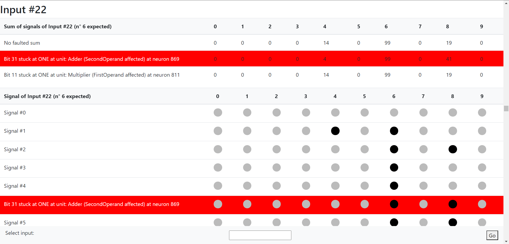
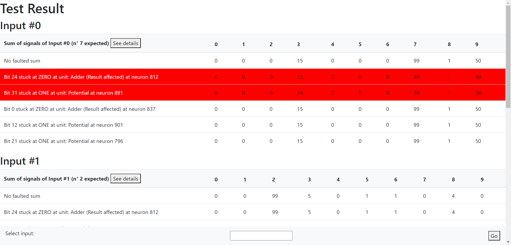
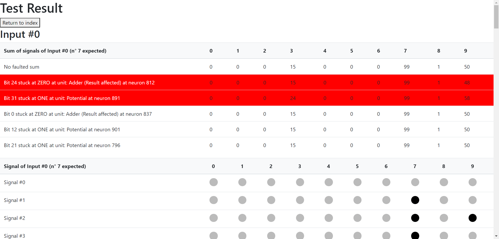

# Spiking Neural Networks and Resilience

Testing of resilience of spiking neural network hardware implementation. 

## Build and Run

You will need a Rust development environment, which you can install by visiting https://rustup.rs/ and following the instructions.

Move to the SNN folder:

```
cd SNN
```

To build the project use:

```
cargo build
```

To run the [example main](SNN/src/main.rs), use:

```
cargo run
```

Following the instructions on how the project is structured and on how to simulate the inferences with the faults.

## Structure of the project

The spiking neural network is described by the SNN struct, containing:
- `layers` : vector of layer identifier of the snn
- `neurons:`  vector of neuron identifier of the snn

The SNN struct implement the functions:
- `new` : creates a new empty SNN
- `from_numpy` : accept a vector of paths to numpy files, each one representing a layer (order is relevant), and the neurons's parameters, as the time constant, the threshold potential, the reset potential and the rest potential; returns the newly created SNN.
- `new_layer` : creates a new layer returning the layer identifier
- `new_neuron` : creates a new neuron, accepting the layer identifier, the potential, the rest potential, the reset potential, the threshold potential and the time constant, and returns the neuron identifier.
- `new_synapse` : that accept the two neuron identifiers and the weight of the synapse, add a synapse


Layers are described by the Layer struct, with :
- `id` : layer identifier
- `neurons` : vector of neuron identifier contained in the layer

Neurons are described by the Neuron struct, with:
- `id` : neuron identidier
- `layer_id` : layer identidier
- `next_layer_synapses` : vector of synapses in the same layer
- `next_layer_synapses` : vector of synapses in the next layer

The neuron configuration is described by the NeuronConfig struct: 
- `threshold_potential` : neuron threshold potential value
- `rest_potential` : neuron rest potential value
- `reset_potential` : neuron reset potential value
- `time_constant` : neuron time constant value


The neuron parameters that vary during the inference are described by the NeuronInferenceParams struct:
- `id` : neuron identidier
- `potential` : neuron potential value
- `last_activity` : last step when  the neuron potential was recalculated
  (in the activation function this value can be used with the current_step to calculate the steps passed)
- `input` : the input signal of the neuron in the step (sum of the activated synapses' weights)
- `triggered` : set true if neuron received an input signals


## Faults

Dfferent kind of faults can be added to the function in order to test the resiliance of the SNN.

There are three types of faults that can be selected from the Fault enum. Here are the values:

- `StuckAtZero` : one random bit of the unit is set to zero for the duration of the inference
- `StuckAtOne` : one random bit of the unit is set to one for the duration of the inference
- `Transient` : one random bit of the unit is flipped in a random moment during the inference

There are different unit to add faults to that can be selected from the Unit enum. Here are the values:

*elaboration units*

- `Adder` : adder component working in the neuron activation function. The fault is randomically added to the result, to the first addend or to the second addend.

- `Multiplier` : multiplier component working in the neuron activation function. The fault is randomically added to the result, to the first factor or to the second factor.

- `Comparator` : comparator component working in the neuron activation function. The fault is randomically added to the left hand side or the right hand side of the comparison.

*memory units*

- `SynapseWeight` : weight of a synapse connecting two neurons. The fault is added to a randomically chosen synapse in the SNN.

- `RestPotential` : rest potential of a neuron. The fault is added to a randomically chosen neuron in the SNN.

- `ThresholdPotential` : threshold potential of a neuron. The fault is added to a randomically chosen neuron in the SNN.
- `ResetPotential` : reset potential of a neuron. The fault is added to a randomically chosen neuron in the SNN.
- `Potential` : potential of a neuron. The fault is added to a randomically chosen neuron in the SNN.

*communication*

- `NeuronInput` : input value of a neuron after each iteration (sum of all weights of the synapses connected to a triggered neuron). The fault is added to the input value of a randomically chosen neuron in the SNN.

- `NeuronOutput` : output value of a neuron after each iteration (is the neuron triggered or not). The fault is added to the output value of a randomically chosen neuron in the SNN. In this case the stuck at zero fault force the neuron to never trigger, the stuck at one to always trigger, and the transient to trigger when it's not and viceversa in one random moment during the inference.


## Test function

Test the SNN over a given array of possible faults
### Arguments

* `snn` : Arc smart pointer encapsulating the Snn struct representing the spiking neural network
* `input_reader`: input reader to access inputs [specifications](#input)
* `faults_to_add`: vector of possible faults to be added to the test
* `n_inferences`: number of inferences of the input matrices each one randomly adding one of the faults in the fault_to_add array
* `delta`: time measure of a time step
* `f`: activation function of the neuron [specifications](#activation-function)
* `expected_outputs` : outputs expected [specifications](#input)

### Return

Vector of Outputs, containing for each input the output with no fault added and the list of outputs with the faults added [specifications](#output)

### Activation Function

The activation function accept:
* `neuron_config`: &NeuronConfig : reference to the SNN Neuron configuration
* `neuron_params`: &NeuronInferenceParams: reference to neuron variable parameters
* `current_step` : i32 : the current step of the execution
* `delta` : f32 : the time measure of the time step
* `testing_add` : Box<dyn Fn(f32, f32) -> f32> : adding function between f32 modified to accept faults
* `testing_mul` : Box<dyn Fn(f32, f32) -> f32> : multiplier function between f32 modified to accept faults
* `testing_cmp` : Box<dyn Fn(f32, f32) -> Ordering> : comparator function between f32 modified to accept faults


Returns a pair (f32, bool) as new calculated potential and whether the neuron was triggered or not.

Testing functions should be used instead of the +, * and <=> between f32 operations in order to allow testing of the adding, multiplier and comparator units, like in the example below:

```
// a+b
let result = a.testing_add(b);

// a*b
let result = a.testing_mul(b);

// a == b 
let result = a.testing_cmp(b) == Ordering::Eq;
// a > b
let result = a.testing_cmp(b) == Ordering::Less;
// a < b
let result = a.testing_cmp(b) == Ordering::Greater;
```


However, if testing on those units is not specified in the *faults_to_add* parameter of the *test* function, the use of testing functions can be avoided.


### Example

Implementation of the Leaky Integrate and Fire model:

```
let f = |neuron_config: &NeuronConfig, neuron_params: &NeuronInferenceParams, current_step: i32, delta: f32,
testing_add: Box<dyn Fn(f32, f32) -> f32>,
testing_mul: Box<dyn Fn(f32, f32) -> f32>,
testing_cmp: Box<dyn Fn(f32, f32) -> Ordering>| {

let a = testing_add(neuron_params.potential, -neuron_config.rest_potential);

let b = testing_mul(testing_add(current_step as f32, -neuron_params.last_activity as f32), delta);

let c = (-b / neuron_config.time_constant).exp();

let mut new_potential = testing_add(testing_add(neuron_config.rest_potential, testing_mul(a, c)), neuron_params.input_signal);

let triggered = testing_cmp(new_potential, neuron_config.threshold_potential) == Ordering::Greater;

if triggered { new_potential = neuron_config.reset_potential };

(new_potential, triggered)
};
```

## Input


The *test* function accepts an instance of **InputReader**. This struct can be generated by the associated function *from_numpy*, that accept the path of the numpy file with the list of inputs and an optional limit of the size of the imput, and return a n instance of InputReader.

The **InputReader** structure maintains the original numpy matrix, and generates directly the input of the first hidden layer (avoiding to re-generate them every time the input is used during the multiple instances). However, the necessity of the input reader is needed to modify the input in case faults affected the neurons of the input layer and the synapses connecting those to the first hidden layer.

The **ExpectedOutput** is a struct composed by the u8 type value.

It implements the function *from_numpy* that accept the path of the numpy file with the list of outputs and returns a vector of ExpectedOutput.
It also implement the function *dummy*, that accepts the lenght of the input vector and return a dummy ExpectedOutput if the actual vector is not avalable.


## Output

The *test* function returns a vector of outputs each one having:

- input_id: input identifier
- expected_output: output value expected
- no_fault_output: output matrix with no fault added
- with_fault_added: vector of outputs with fault added

Each output with fault added is composed by:

- output: output matrix obtained after the fault were added
- fault: type of fault added
- unit: unit whom fault was added

### Print output

The result of the test function can be pretty printend using the function *print_output*.

An example can be: 

 ```
Input #0 (n°7 expected)

#################

NO FAULT OUTPUT:

[0, 0, 0, 14, 0, 0, 0, 72, 1, 32]

VALUE: 7

#################

FAULTED OUTPUTS:

adding fault: Bit 25 stuck at one at unit: Adder (Result affected) at neuron 796: 
[0, 0, 0, 14, 0, 0, 0, 72, 1, 32]

VALUE: 7

adding fault: Bit 27 stuck at one at unit: Adder (SecondOperand affected) at neuron 815: 
[0, 0, 0, 19, 0, 0, 0, 71, 5, 24]

VALUE: 7

Input #1 (n°2 expected)

#################

NO FAULT OUTPUT:

[1, 0, 76, 7, 0, 4, 3, 0, 10, 0]

VALUE: 2

#################

FAULTED OUTPUTS:

adding fault: Bit 25 stuck at one at unit: Adder (Result affected) at neuron 796: 
[1, 0, 75, 7, 0, 3, 3, 0, 10, 0]

VALUE: 2

adding fault: Bit 27 stuck at one at unit: Adder (SecondOperand affected) at neuron 815: 
[1, 0, 76, 7, 0, 4, 3, 0, 10, 0]

VALUE: 2
 ```

### HTML visualization

In order to visualize the results of the test, the module *renderer.rs* can be used, calling the render_to_html function. 
The function accept the output of the *test* function (Vec\<Output>), the path where to store the pages and the *index_page* parameter, that force the use of a single html page.

Since the html files take a lot of storage and are difficult to render, there are different limitations:

- **single page visualization** is only possible if the total output file is **smaller that 2MB** (about 320 inferences of 100 steps each)
- if more than 20 MB of storage are required (about 3200 inferences of 100 steps each) a warning is shown
- if **more than 200 MB** of storage are required (about 32000 inferences of 100 steps each) the **output is not generated**

These limitation are added to avoid to erroneously generate large amuont of data.


Using the single page representation, for each input there are two part:
- in the inital part the sum of all signals are shown for the not fauted inference output and for each faulted inference output (in red those which differ from the no fault)
- in the second part the list of each signal is shown, and if the faulted version has any difference from the one with no fault, the broken signal is shown, with a red background.

Here's a screenshot:




Directory representation divides the single page in multiple files.
A new folder *output{n}* is created with and index file having the sum of all signals for each input, with the not faulted inference output as first row and all the faulted inferences following (in red those which differ from the no fault). A button in the header allows to go to the input detail.

Each input detail is a different html file, divided in two part (like the second page representation):
- in the inital part the sum of all signals are shown for the not fauted inference output and for each faulted inference output (in red those which differ from the no fault)
- in the second part the list of each signal is shown, and if the faulted version has any difference from the one with no fault, the broken signal is shown, with a red background.

Here's the index screenshot:



And here's s single input screenshot:



